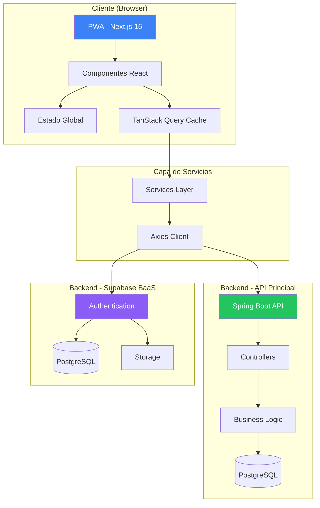
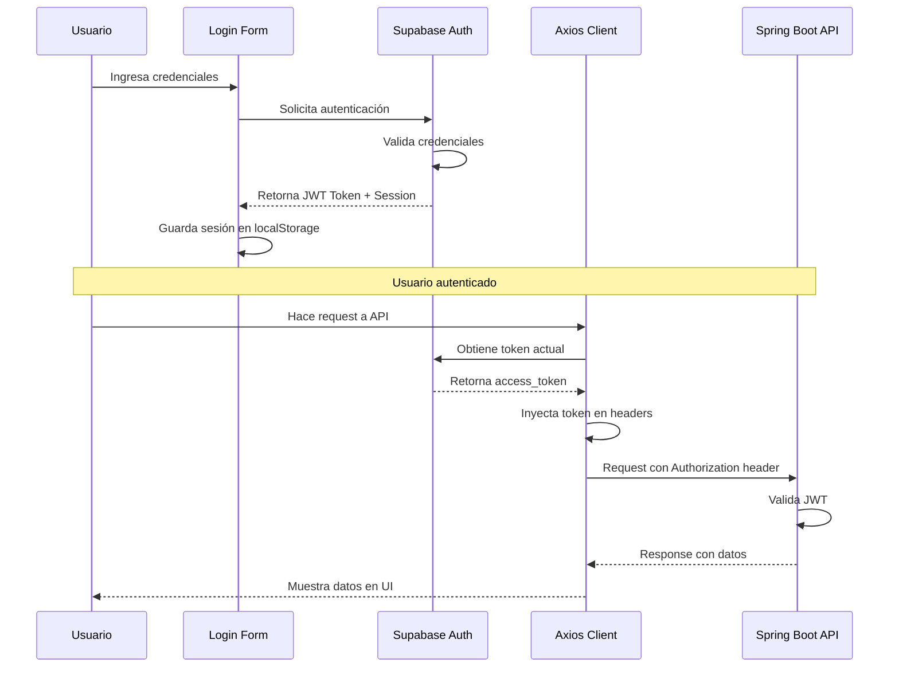
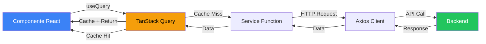
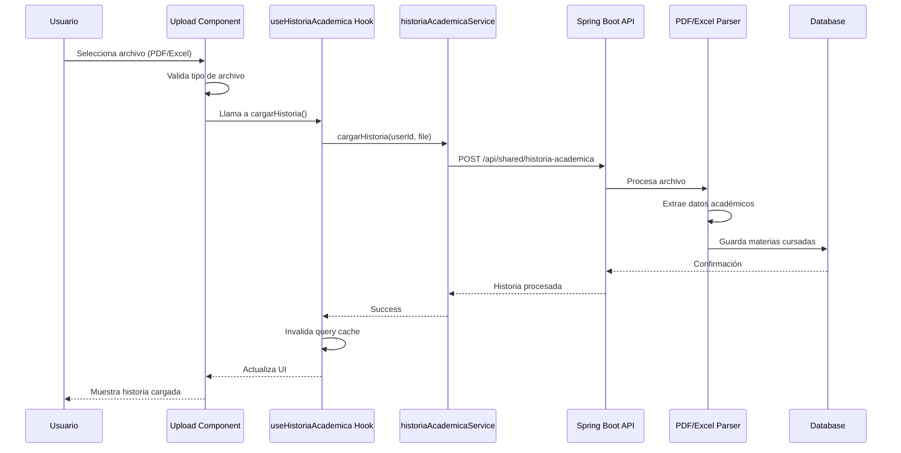
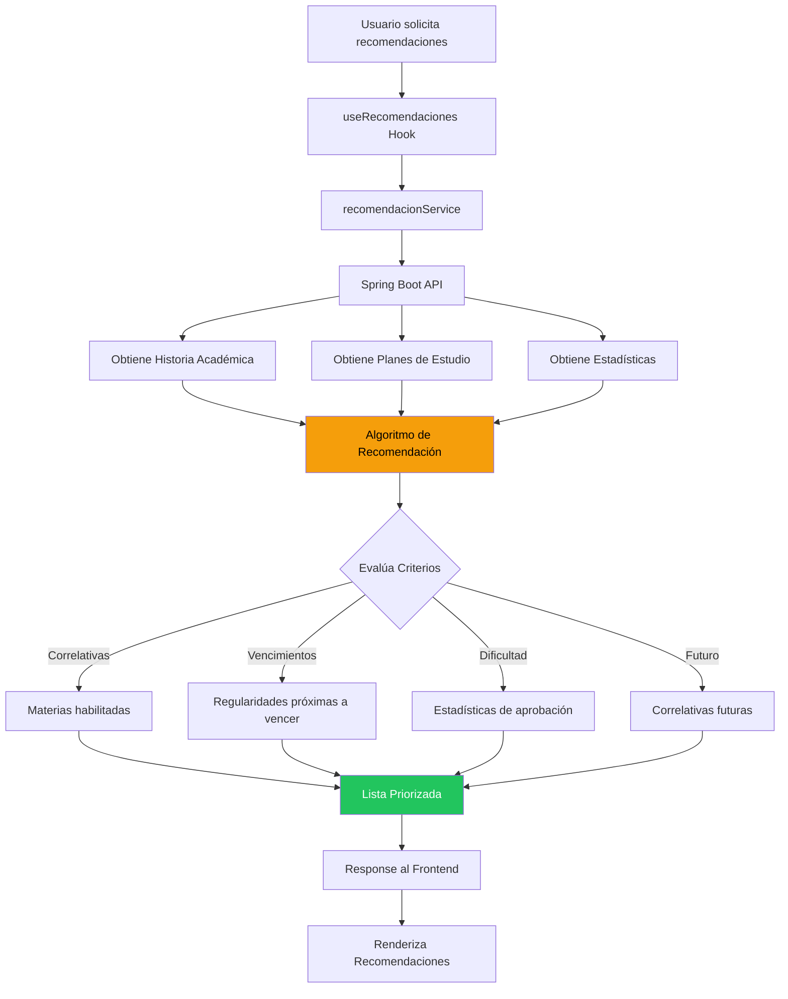
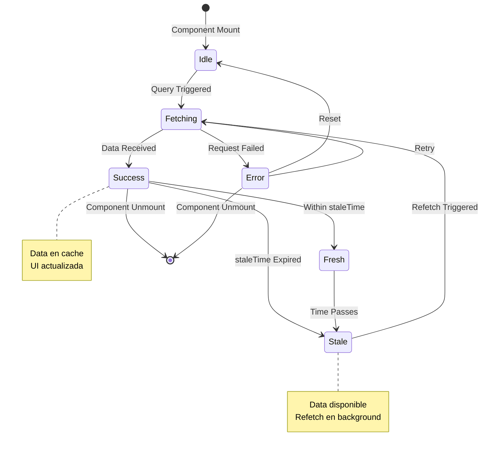
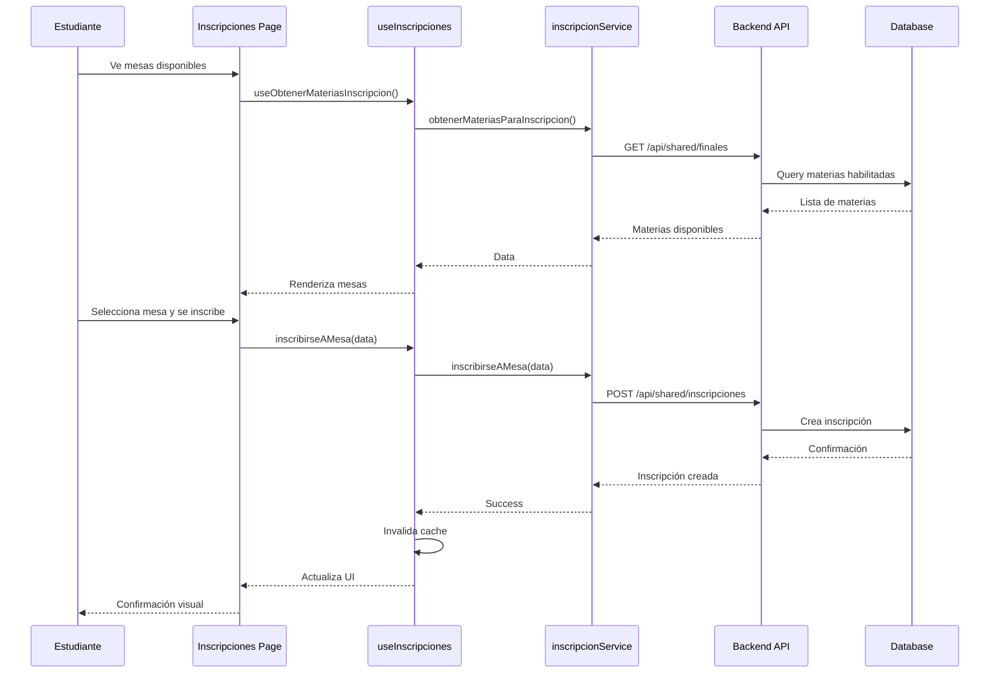

# 📊 Diagramas del Sistema

Esta sección contiene diagramas visuales de la arquitectura, flujos de datos y componentes del sistema.

---

## 1. Diagrama de Arquitectura General



---

## 2. Flujo de Autenticación



---

## 3. Flujo de Datos con TanStack Query



---

## 4. Arquitectura de Componentes

```
┌─────────────────────────────────────────────────────────────┐
│                      App Layout (Root)                       │
│  ┌───────────────────────────────────────────────────────┐  │
│  │              Client Layout Provider                    │  │
│  │  ┌─────────────────────────────────────────────────┐  │  │
│  │  │         QueryClientProvider                      │  │  │
│  │  │  ┌───────────────────────────────────────────┐  │  │  │
│  │  │  │        ThemeProvider                       │  │  │  │
│  │  │  │  ┌─────────────────────────────────────┐  │  │  │  │
│  │  │  │  │         Page Content                │  │  │  │  │
│  │  │  │  │                                     │  │  │  │  │
│  │  │  │  │  ┌──────────────┐ ┌─────────────┐  │  │  │  │  │
│  │  │  │  │  │  Components  │ │   Modals    │  │  │  │  │  │
│  │  │  │  │  └──────────────┘ └─────────────┘  │  │  │  │  │
│  │  │  │  │                                     │  │  │  │  │
│  │  │  │  │  ┌──────────────┐ ┌─────────────┐  │  │  │  │  │
│  │  │  │  │  │    Hooks     │ │   Stores    │  │  │  │  │  │
│  │  │  │  │  └──────────────┘ └─────────────┘  │  │  │  │  │
│  │  │  │  └─────────────────────────────────────┘  │  │  │  │
│  │  │  └───────────────────────────────────────────┘  │  │  │
│  │  └─────────────────────────────────────────────────┘  │  │
│  └───────────────────────────────────────────────────────┘  │
└─────────────────────────────────────────────────────────────┘
```

---

## 5. Estructura de Rutas (App Router)

```mermaid
graph TD
    Root[/ - Landing Page]
    
    Root --> Auth[/auth]
    Auth --> Login[/auth/login]
    Auth --> Register[/auth/register]
    
    Root --> Dashboard[/dashboard]
    
    Root --> Student[/student]
    Student --> Historia[/student/historia]
    Student --> Recomendaciones[/student/recomendaciones]
    Student --> Inscripciones[/student/inscripciones]
    Student --> Experiencias[/student/experiencias]
    
    Root --> Admin[/admin]
    Admin --> AdminDash[/admin/dashboard]
    Admin --> Planes[/admin/planes]
    Admin --> Stats[/admin/estadisticas]
    
    Root --> Perfil[/perfil]
    Root --> EstadisticasM[/estadisticasMateria]
    
    style Root fill:#3b82f6,color:#fff
    style Student fill:#22c55e,color:#fff
    style Admin fill:#ef4444,color:#fff
    style Auth fill:#8b5cf6,color:#fff
```

---

## 6. Flujo de Carga de Historia Académica



---

## 7. Sistema de Recomendaciones



---

## 8. Gestión de Estado Global

```
┌──────────────────────────────────────────────────────────┐
│                    Estado de la Aplicación                │
├──────────────────────────────────────────────────────────┤
│                                                           │
│  ┌─────────────────────┐      ┌─────────────────────┐   │
│  │   Zustand Stores    │      │  TanStack Query     │   │
│  │   (Client State)    │      │  (Server State)     │   │
│  ├─────────────────────┤      ├─────────────────────┤   │
│  │                     │      │                     │   │
│  │ • modal-store       │      │ • Queries Cache     │   │
│  │   - isOpen          │      │   - estudiante      │   │
│  │   - modalType       │      │   - historia        │   │
│  │   - modalData       │      │   - inscripciones   │   │
│  │                     │      │   - experiencias    │   │
│  │ • ui-store          │      │   - estadísticas    │   │
│  │   - sidebarOpen     │      │                     │   │
│  │   - theme           │      │ • Mutations         │   │
│  │   - preferences     │      │   - crear           │   │
│  │                     │      │   - actualizar      │   │
│  └─────────────────────┘      │   - eliminar        │   │
│                               └─────────────────────┘   │
│                                                           │
│  Sincronización:                                          │
│  ┌─────────────────────────────────────────────────┐     │
│  │  Zustand ←→ LocalStorage (persistencia)         │     │
│  │  TanStack Query ←→ API (sincronización)         │     │
│  └─────────────────────────────────────────────────┘     │
└──────────────────────────────────────────────────────────┘
```

---

## 9. Arquitectura de Servicios

```
┌─────────────────────────────────────────────────────────┐
│                    Services Layer                        │
├─────────────────────────────────────────────────────────┤
│                                                          │
│  estadisticasService ──┐                                │
│  experienciaService ───┤                                │
│  historiaAcademicaService ─┤                            │
│  inscripcionService ───┤   │                            │
│  materiaService ───────┤   │                            │
│  perfilService ────────┤   ├──→ axiosClient ──→ Backend │
│  personaService ───────┤   │                            │
│  planesEstudioService ─┤   │                            │
│  recomendacionService ─┘   │                            │
│                             │                            │
│  ┌──────────────────────────┘                           │
│  │                                                       │
│  └──→ Interceptors:                                     │
│       • Request: Inyecta JWT token                      │
│       • Response: Maneja errores globales               │
│                                                          │
└─────────────────────────────────────────────────────────┘
```

---

## 10. Ciclo de Vida de una Query



---

## 11. Flujo de Inscripción a Mesa de Examen



---

## 12. Arquitectura de Componentes UI

```
┌─────────────────────────────────────────────────────┐
│              Componentes de UI (Jerarquía)          │
├─────────────────────────────────────────────────────┤
│                                                      │
│  Nivel 1: Primitivos (Radix UI)                     │
│  ┌────────────────────────────────────────────┐    │
│  │ Dialog, Dropdown, Select, Checkbox, etc.   │    │
│  └────────────────────────────────────────────┘    │
│                      ↓                               │
│  Nivel 2: Componentes Base (ShadCN)                 │
│  ┌────────────────────────────────────────────┐    │
│  │ Button, Card, Input, Label, Toast, etc.    │    │
│  └────────────────────────────────────────────┘    │
│                      ↓                               │
│  Nivel 3: Componentes Compartidos                   │
│  ┌────────────────────────────────────────────┐    │
│  │ Skeleton, ModeToggle, ThemeProvider        │    │
│  └────────────────────────────────────────────┘    │
│                      ↓                               │
│  Nivel 4: Componentes de Dominio                    │
│  ┌────────────────────────────────────────────┐    │
│  │ ExperienciaCard, HistoriaTable,            │    │
│  │ RecomendacionCard, InscripcionCard         │    │
│  └────────────────────────────────────────────┘    │
│                      ↓                               │
│  Nivel 5: Páginas                                    │
│  ┌────────────────────────────────────────────┐    │
│  │ StudentPage, AdminPage, DashboardPage      │    │
│  └────────────────────────────────────────────┘    │
│                                                      │
└─────────────────────────────────────────────────────┘
```

---

## 13. Diagrama de Deployment

```
┌──────────────────────────────────────────────────────┐
│                    Vercel Edge Network                │
│  ┌────────────────────────────────────────────────┐  │
│  │         Next.js Application (SSR + SSG)        │  │
│  │                                                 │  │
│  │  • Static Assets (CDN)                         │  │
│  │  • Serverless Functions                        │  │
│  │  • Edge Functions                              │  │
│  │  • Automatic HTTPS                             │  │
│  └────────────────────────────────────────────────┘  │
└──────────────────────────────────────────────────────┘
                         │
                         │ HTTPS
                         ▼
┌──────────────────────────────────────────────────────┐
│                  Backend Services                     │
│                                                       │
│  ┌─────────────────────┐    ┌──────────────────┐    │
│  │   Render.com        │    │    Supabase      │    │
│  │                     │    │                  │    │
│  │ • Spring Boot API   │    │ • Auth Service   │    │
│  │ • PostgreSQL DB     │    │ • PostgreSQL DB  │    │
│  │ • Auto-deploy       │    │ • Storage        │    │
│  └─────────────────────┘    └──────────────────┘    │
└──────────────────────────────────────────────────────┘
```

---

## Leyenda de Colores (Mermaid)

- 🔵 **Azul**: Frontend / Cliente
- 🟢 **Verde**: Backend / API
- 🟣 **Púrpura**: Autenticación / Seguridad
- 🟡 **Amarillo**: Cache / Estado
- 🔴 **Rojo**: Administración

---

## Notas Técnicas

### Diagramas Mermaid
Los diagramas en formato Mermaid pueden ser renderizados en:
- GitHub (automáticamente)
- GitLab
- Editores como VS Code (con extensión)
- Herramientas online: [Mermaid Live Editor](https://mermaid.live/)

### Actualización de Diagramas
Los diagramas deben actualizarse cuando:
- Se agreguen nuevos módulos o servicios
- Cambien flujos de datos importantes
- Se modifique la arquitectura general

---

**Próximo**: [Guía de Desarrollo →](./12-guia-desarrollo.md)
